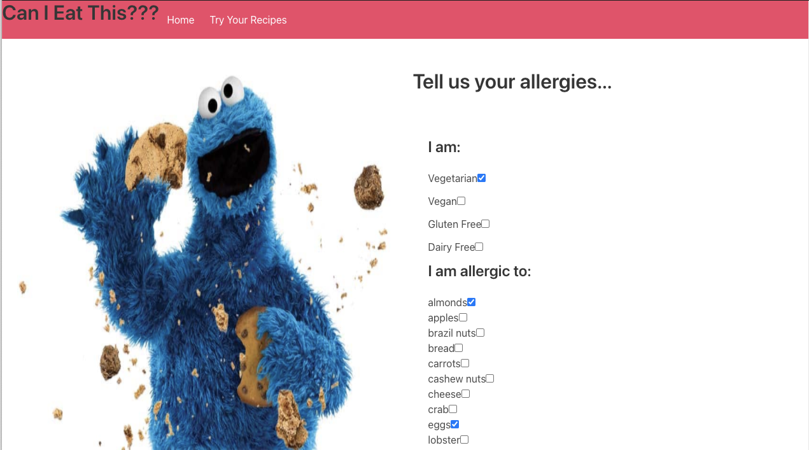
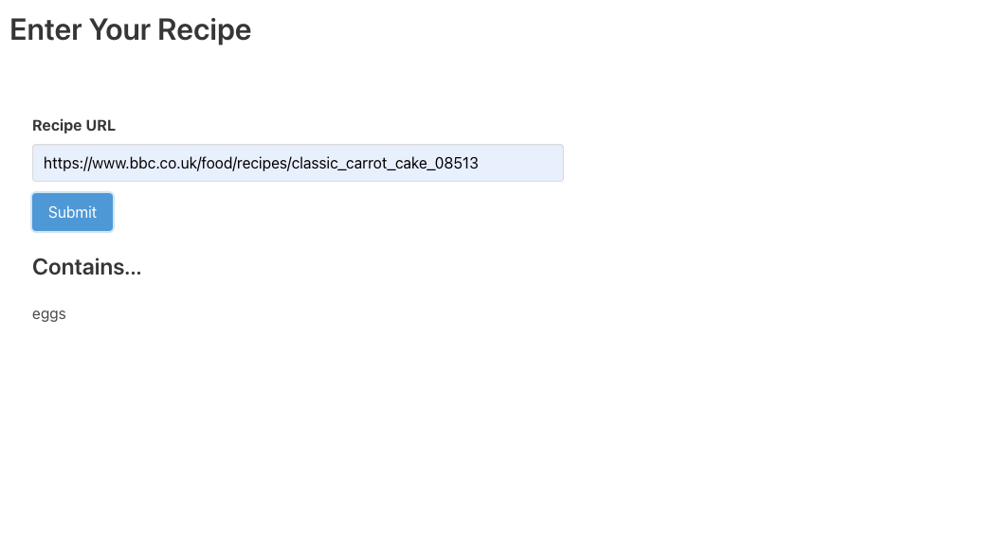
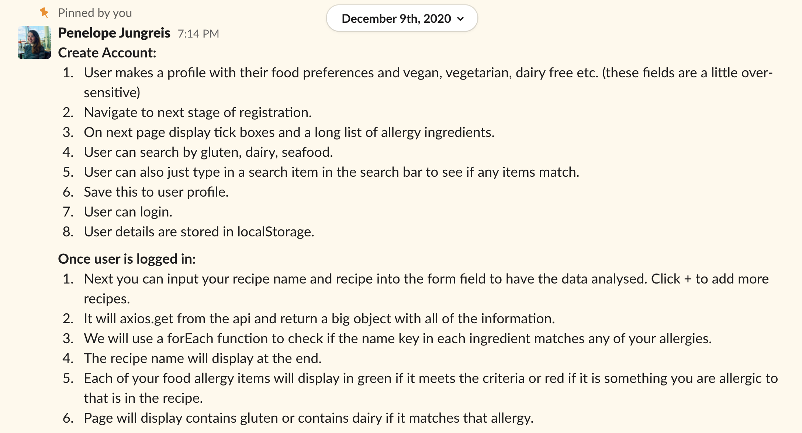
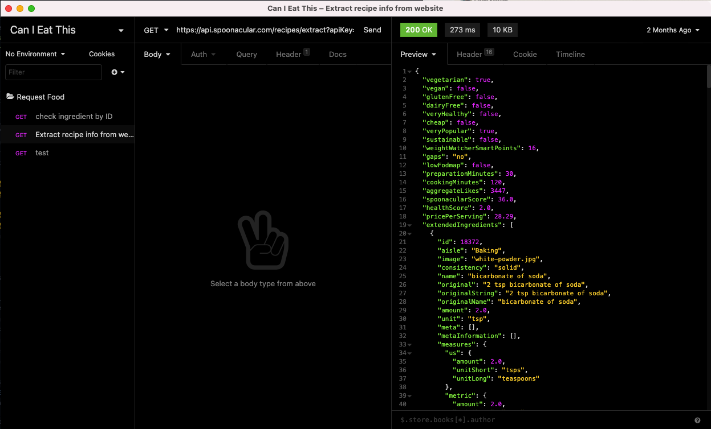

# Can I Eat This 🍪
by [Alberto Cerrone](www.linkedin.com/in/alberto-cerrone) && [Penelope Jungreis](https://github.com/penelopecj)<br>


<br>
Timeline: 48h

👉 [<b>Try Me</b>](https://canieatthis.netlify.app/) 👈

---

## Overview
<br>

Can I Eat This is a website where users can select their allergies and dietary restrictions from a list, then input any recipe URL and the website will give back a list of the user's allergens that are contained in the recipe.

This React app is my first pair-coding 48-hour hackathon, using the Spoonacular API. 

---

### Table of Contents

- [Get Started](#get-started)
  - [Required](#required)
  - [Installation Steps](#installation-steps)
  - [How To Use It](#how-to-use-it)
- [How I Made It](#how-i-made-it)
  - [Technologies Used](#technologies-used)
  - [Approach Taken](#approach-taken)
  - [Challenges & Wins](#challenges--wins)
    - [Challenges](#challenges)
    - [Wins](#wins)
  - [Future Features & Key Learning](#future-features--key-learning)
    - [Future Features](#future-features)
    - [Key Learning](#key-learning)
- [Contributors](#contributors)
  - [Contributing to this project](#contributing-to-this-project) 
- [License & Copyright](#license-&-copyright)
- [Author Info](#author-info)

---

## Get Started
### Required

If you would like to participate in this project, you must register to [Spoonacular API](https://spoonacular.com/food-api) website to receive your API key.<br>
Create a `.env` file at the root of the project and add this snippet:
`
REACT_APP_SPOONACULAR_API_KEY=yourAPIKey
`
<br>


### Installation Steps
Clone or download the repository, then do the following in Terminal:

- Install front-end dependencies: `yarn`
- Start front-end server: `yarn start`
### How to Use It

<br>
When you land on Can I Eat This, the first page will allow you to select your allergies and intolerances. <br>
These values will be stored, then every time you will visit the website, we'll remember about your choices.

After selecting all your preferences you can navigate to the next page using the button `Continue` at the bottom of the page.

<br>
On this page, you can submit the URL of the recipes that you have found on the web. After submission, Can I Eat This will find all the ingredients and report only the ones that are harmful to you.

[Back To The Top](#can-i-eat-this-)

---
## How I Made It
### Technologies Used

#### Languages Used
- [JavaScript](https://www.javascript.com/)
- [SASS](https://sass-lang.com/)
#### Frameworks
- [React with React Hooks](https://reactjs.org/)
- [Bulma](https://bulma.io/)
#### Dependencies
- [Axios](https://github.com/axios/axios)
- [React-router-dom](https://reactrouter.com/web/guides/quick-start)
#### External API
- [Spoonacular API](https://spoonacular.com/food-api)
### Approach Taken

For this hackathon, I and Penny had to choose an API we wanted to use. Since both of us have a passion for food and love to try new recipes, so we decided to use Spoonacular API to build something useful and meaningful related to health.


We decided to pair code most of the app on Visual Studio Code Live Share to mix our knowledge and to avoid probable merging problems.

Our first step has been studying the response from the API with Insomnia.
This allowed us to master well this massive API and make it work for our needs.


On the first day, we built all the needs for the landing page and made all the logic with the React hooks useEffect and useState and used the local storage to catch and store information of the user. <br>
Examples are:


```javascript 
//initialized user restrictions with a default object in state
const [user, setUser] = React.useState({
    vegetarian: false,
    vegan: false,
    glutenFree: false,
    dairyFree: false,
    allergies: [],
  })
```

```javascript 
//using useEffect to update the values when any of the checkbox are changed
React.useEffect(() => {
  window.localStorage.setItem('vegetarian', JSON.stringify(vegetarian))
}, [vegetarian])
const handleVegetarian = (event) => {
  setVegetarian(!vegetarian)
}

React.useEffect(() => {
  window.localStorage.setItem('vegan', JSON.stringify(vegan))
}, [vegan])
const handleVegan = (event) => {
  setVegan(!vegan)
}
React.useEffect(() => {
  window.localStorage.setItem('glutenFree', JSON.stringify(glutenFree))
}, [glutenFree])
const handleGlutenFree = (event) => {
  setGlutenFree(!glutenFree)
}
...
```

```javascript 
//this function check if there are already items stored in local storage
const [allergies, setAllergies] = React.useState(() => {
  const currentState = window.localStorage.getItem('allergies')
  if (currentState) return JSON.parse(currentState)
  return []
})
```


On the second and last day, we built the second page with the submit form and used Axios to fetch data from the API.
```javascript
import axios from 'axios'

const baseUrl = 'https://api.spoonacular.com'
const myAPI = process.env.REACT_APP_MY_API_KEY

export function getRecipeInfo(pageUrl){
  return axios.get(`${baseUrl}/recipes/extract?apiKey=${myAPI}&url=${pageUrl}`)
}
```

Right before the end of the hackathon, we managed to build the functionality that checks the array of allergies in the local storage against the ingredients in the recipe, displaying the list of matches on the page and gave a quick styling with Bulma CSS framework.

```javascript
//function that compare the allergies and dietary restrictions
const checkIngredients = (myRecipe) =>{
    const localStorageAllergies = window.localStorage.getItem('allergies')
    const localStorageVegetarian = window.localStorage.getItem('vegetarian')
    const localStorageVegan = window.localStorage.getItem('vegan')
    const localStorageGlutenFree = window.localStorage.getItem('glutenFree')
    const localStorageDairyFree = window.localStorage.getItem('dairyFree')

    const  ingredients  = myRecipe.extendedIngredients.map(ingredient =>{
      return ingredient.name
    }).filter(element => localStorageAllergies.includes(element))
    
    if (localStorageVegetarian === true) {
      ingredients.push('vegetarian')
    }
    if (localStorageVegan === true) {
      ingredients.push('vegan')
    }
    if (localStorageGlutenFree === true) {
      ingredients.push('gluten free')
    }
    if (localStorageDairyFree === true) {
      ingredients.push('dairy free')
    }
    setBadIngredients(ingredients)
  }
```

[Back To The Top](#can-i-eat-this-)

---
### Challenges & Wins

#### Challenges

We were aiming to a scope that was too big to be made in less than 48h; in our ideal world our app that allowed the user to register, select different allergies and/or intolerances, and, thanks to a Chrome extension, the food checking was done automatically without the user submitting the URL of the website.

As well the API informations regarding <i>gluten free & dairy free</i> aren't totally reliable.

#### Wins
This was for us the first time we were building an app from the ground with React and APIs, and I found that the challenges that an hackathon lets you face are incredible to learn effectively. 

As well, our goal was difficult to be achieved because of the really short amount of time and our competencies ( we didn't have any knowledge of database and authentication) but, we thought to use local storage to achieve something similar and worked great.

[Back To The Top](#can-i-eat-this-)

---
### Future Features & Key Learning

#### Future Features
- [ ] Transform this app in a Chrome browser extension
#### Key Learning
- This was my first-time pair coding on any project and I learnt so much about collaborating and communicating, especially because with my past experiences collaboration it always been a face-to-face process but this time everything was moving through Zoom and VS Code Live Share.
- I loved how a big scope challenged our creativity so much to find a work-around for our needs, but maybe next time I'll try to be more realistic 😅


[Back To The Top](#can-i-eat-this-)

---
## Contributors
* Alberto Cerrone [📧](mailto:cerrone.alberto93@gmail.com)
* Penelope Jungreis [📧](mailto:penelope.jungreis@gmail.com)

### Contributing to this project
If you have suggestions for improving this project, please [open an issue on GitHub](https://github.com/albertocerrone/Can-I-Eat-This/issues/new).

[Back To The Top](#can-i-eat-this-)

---
## License & copyright

This work is dedicated to the [public domain (CC0 1.0)](http://creativecommons.org/publicdomain/zero/1.0/). To the extent possible under law, Alberto Cerrone has waived all copyright and related or neighbouring rights to the "Can I Eat This". See the LICENSE file for all the legalese.


[Back To The Top](#can-i-eat-this-)

---
## Author Info
- Twitter - [@AlbertoCerrone](https://twitter.com/AlbertoCerrone)
- LinkedIn - [Alberto Cerrone](http://www.linkedin.com/in/alberto-cerrone/)
- Website - [Portfolio](http://albertocerrone.co.uk)

[Back To The Top](#can-i-eat-this-)

