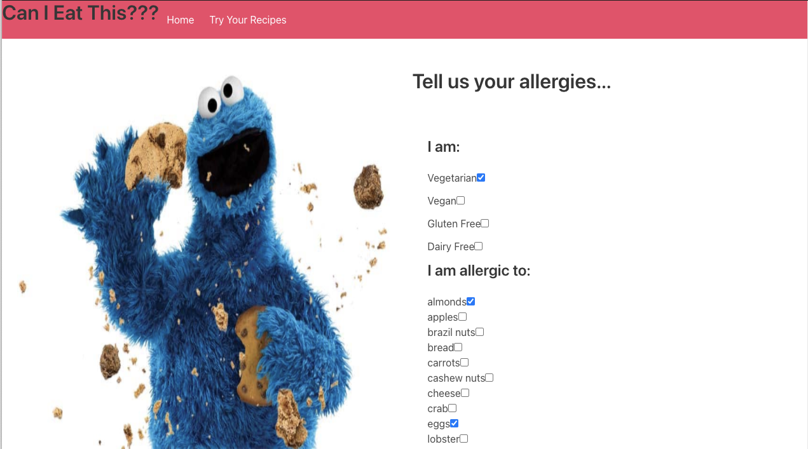
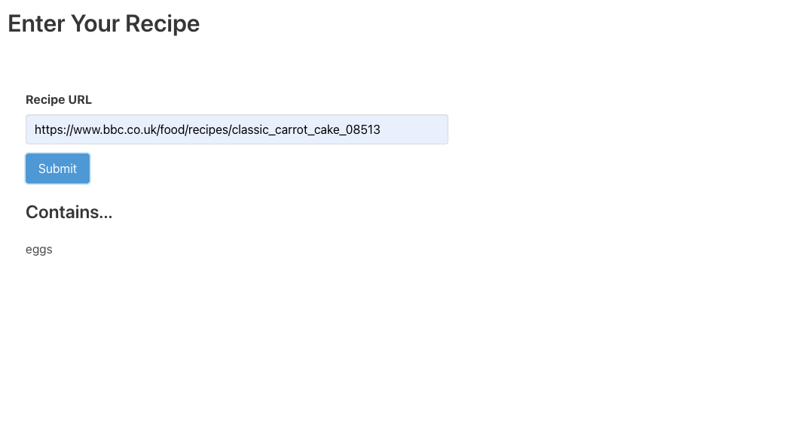

# Can I Eat This 🍪
by [Alberto Cerrone](www.linkedin.com/in/alberto-cerrone) && [Penelope Jungreis](https://github.com/penelopecj) 

 
Timeline: 7 days

👉 [<b>Try me</b>](https://canieatthis.netlify.app/) 👈

---

## Overview
 

Can I Eat This is a website where users can select their allergies and dietary restrictions from a list, then input any recipe URL and the website will give back a list of the user's allergens that are contained in the recipe.

This React app is my first pair-coding 48-hour hackathon, using the Spoonacular API. 

---

### Table of Contents

- [Get Started](#get-started)
  - [Required](#required)
  - [Installation Steps](#installation-steps)
  - [How To Use It](#how-to-use-it)
- [How I Made It](#how-i-made-it)
  - [Technologies Used](#technologies-used)
  - [Approach Taken](#approach-taken)
  - [Bugs, Blockers & Wins](#bugs,-blockers-&-wins)
    - [Bugs](#bugs)
    - [Challenges & Wins](#challenges-&-wins)
  - [Future Features & Key Learning](#future-features-&-key-learning)
    - [Future Features](#future-features)
    - [Key Learning](#key-learning)
- [Contributors](#contributors)
  - [Contributing to this project](#contributing-to-this-project) 
- [License & Copyright](#license-&-copyright)
- [Author Info](#author-info)

---

## Get Started
### Required

If you would like to participate in this project, you must register to [Spoonacular API](https://spoonacular.com/food-api) website to receive your API key. 
Create a `.env` file at the root of the project and add this snippet:
`
REACT_APP_SPOONACULAR_API_KEY=yourAPIKey
`
 

### Installation Steps
Clone or download the repo then do the following in Terminal:

- Install front-end dependencies: `yarn`
- Start front-end server: `yarn start`
### How to Use It

 
When you land on Can I Eat This, the first page will allow you to select your allergies and intolerances.  
These values will be stored, then every time you will visit us, we'll remember about your choices.

After selecting all your preferences you can navigate to the next page using the button `Continue` at the bottom of the page.

 
On this page, you can submit the URL of the recipes that you have found on the web. After submission, Can I Eat This will find all the ingredients and report only the ones that are harmful to you.

[Back To The Top](#can-i-eat-this-)

---
## How I Made It
### Technologies Used

#### Languages Used
- [Javascript](https://www.javascript.com/)
- [SASS](https://sass-lang.com/)
#### Frameworks
- [React with React Hooks](https://reactjs.org/)
- [Bulma](https://bulma.io/)
#### Dependencies
- [Axios](https://github.com/axios/axios)
- [React-router-dom](https://reactrouter.com/web/guides/quick-start)
#### External API
- [Spoonacular API](https://spoonacular.com/food-api)
### Approach Taken

For my final project in General Assembly, I wanted to build something using Material-UI. This because I've been learning Material-UI on my own during the course and I wanted to bullet-proof my knowledge with this UI framework.
As well I wanted to build something in a team because I believe in the African proverb "If you want to go fast, go alone. If you want to go far, go together".

When Daniel approached me with the idea of building a bug tracker app, I was instantly interested. It was matching my vision of building something that was going to:
- be useful to me in the future 
- talk about a common business problem
- have a user authentication 
- have an attractive and responsive UI

##### Planning
We spent the first day planning every face of the project:
* We used a Trello board to throw down all the tasks that we considered important to do for our MVP.

* Our back-end and all the relationships were planned using [QuickDB](https://app.quickdatabasediagrams.com/#/d/p9TZMZ).  
 
My partner was intrigued to allow every user of the website to don't have a pre-decided role (manager or developer) but to give this choice every time the user is going to create a new project.  
Be the manager of the project allows the user to create new tickets (tasks) and to update the status of the ticket as "Resolved". On the other end,  being a developer allows changing the status of the tickets between "In Progress", "Feedback" and "Blocked".
To do so, we created a join table called "Group_member" that store the user_id and what role they have in every project.

* Since I wanted to use Material-UI, I spent a bit of time, researching ideas of the style that I wanted to give. 
It's been really helpful downloading various templates and guides to take inspiration and the one created by [Devias](https://material-ui.com/store/items/devias-kit/) felt matching with my vision for this app.  
Using a template as a reference, allowed me to boost my development process and to take care not only of the UI but backend too.

After the day of planning, the first 2 days of coding were focused on building the backend with Django and PostgreSQL.
The second day, Daniel started to set up React and starting to work on the frontend's logic, and I finished building the rest of Django.

From the third day until the last, both of us were working together on the frontend. We organized each other in a way that Daniel was going to create the logic of the component needed and leaving me a good base where to implement all the styling from Material-UI.

[Back To The Top](#can-i-eat-this-)

---
### Bugs, Blockers & Wins

#### Bugs
- [ ] Fix problems with roles and different limitations
- [ ] Fix responsiveness and background issue in the landing page
- [ ] Fix problems/refactor error handling
- [ ] Fix floating buttons that move while scrolling
- [ ] Change Icons in Tickets page
- [ ] Fix icons on the Project page (if the description is long they move at the bottom of the card)
- [ ] Fix navbar that changes color when scrolling
- [ ] Fix New ticket function (doesn't give the option to select the type)
 
#### Challenges & Wins
Building this project is been fun but, the short timeline didn't allow us to implement all the features that we were thinking to add, especially the most useful ones like the opportunity to update the tickets. 
We had to cut some corners and twist a bit our backend diagram during the last hours before deadline.

One of my biggest challenges is been the implementation of the second step where the user selects who is a member of the team and what roles he/she has. 
Took me a full day, but with the help from Daniel and my coach, we managed to implement a feature that I'm proud of. 
 
You can see the code from [here](client/src/components/roles&groups)
As well I love the responsiveness and the opportunity to be used without any problems on a small screen.

[Back To The Top](#can-i-eat-this-)

---
### Future Features & Key Learning

#### Future Features
- [ ] Add Transitions & Animations
- [ ] Add Notification feature
- [ ] Add Analytics page where user can find charts reflecting the performance tickets & projects
- [ ] Improve Account page with better UI
- [ ] Add Setting page where the user can switch between Dark Mode/ Light Mode and where to change the account password
- [ ] Make Tasks Progress bar working
- [ ] Improve UI for Ticket's comments
#### Key Learning
This project was one of my favorites where I had the opportunity to learn so much. 
I loved work with Django and Python. It allowed us to build the backend with a higher speed compared to Node.js

But I feel that the best takeaway is coming from the use of the template for reference. 
Using the template allowed me to enter in contact with a code written from a stranger, with a completely different design pattern and new libraries like prop-types. 
Prop-types, in particular, allowed me to enter in contact with type checking and a little taste of how useful can be with bigger projects.  
Now I'm really curious to learn more about type checking and TypeScript in particular.

[Back To The Top](#can-i-eat-this-)

---
## Contributors
* Alberto Cerrone [📧](mailto:cerrone.alberto93@gmail.com)
* Penelope Jungreis [📧](mailto:dfernandezda21@gmail.com)

### Contributing to this project
If you have suggestions for improving this project, please [open an issue on GitHub](https://github.com/albertocerrone/Can-I-Eat-This/issues/new).

[Back To The Top](#can-i-eat-this-)

---
## License & copyright

This work is dedicated to the [public domain (CC0 1.0)](http://creativecommons.org/publicdomain/zero/1.0/). To the extent possible under law, Alberto Cerrone has waived all copyright and related or neighbouring rights to the "Can I Eat This". See the LICENSE file for all the legalese.

[Back To The Top](#can-i-eat-this-)

---
## Author Info
- Twitter - [@AlbertoCerrone](https://twitter.com/AlbertoCerrone)
- LinkedIn - [Alberto Cerrone](http://www.linkedin.com/in/alberto-cerrone/)
- Website - [Portfolio](http://albertocerrone.co.uk)

[Back To The Top](#can-i-eat-this-)

